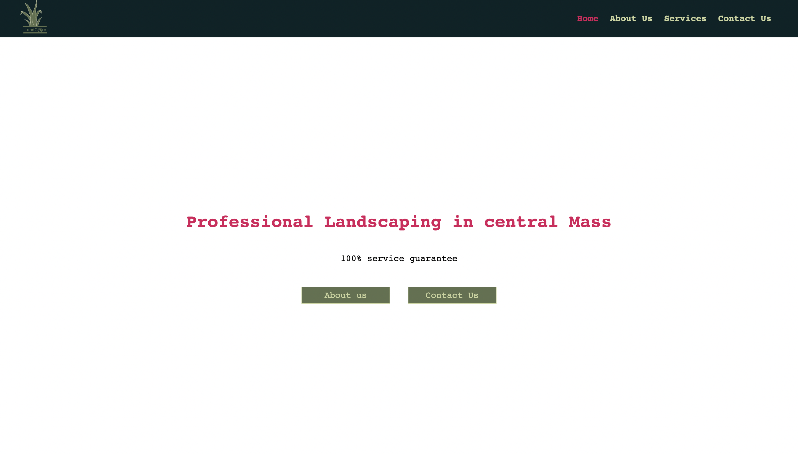

# Landcare



landcare is a landscaping website built with react(class based component) express and mongodb.
You can see it live [here](https://idrisscissoko.com/landcare/) </br>

# Prerequisites :

To clone and run this application, you'll need [Git](https://git-scm.com) and [Node.js](https://nodejs.org/en/download/) (which comes with [npm](http://npmjs.com)) installed on your computer.

# Technology used :

- React
- node-sass
- axios
- react-router-dom
- animate.css
- express
- Jsonwebtoken
- mongodb
- mongoose
- cookie-parser
- cors
- dotenv

# Features

- Authentication
- Asynchronous javascript
- database models creation and querying
- crud operations
- Animation
- Error handling
- Admin dashboard

# How to use

```bash
# Clone this repository
$ git clone https://github.com/idriss30/landcarev2.git

# Go into the repository
$ cd Landcare

# Install backend dependencies
$ npm install


#install Front-end dependencies
$ cd client
$ npm install

# create environment variables
$ create a .env file on root folder for backend

# you will need 3 environment variables
PORT # port on which you want to run the backend server
DATABASE_URI # mongodb database url and authentication
PASSPHRASE # string you want to use to authenticate jsonwebtoken

# navigate to the client and create another .env file for the client
$ cd client
$ create .env file

# you will need two environment variables
REACT_APP_LINK # url where you react app is running
REACT_APP_BACKENDLINK # url of your backend server


# Run the app
$ npm run start
# navigate to front-end
$ cd client
$ npm run start

# Create front-end build
$ npm run build

```

# Author

Created by me Idris.</br>
You can find me on [LinkedIn](https://www.linkedin.com/in/idrissciss/)

# Support

If you learn anything from this project and/or would like to support:</br>
Please give a star, I would appreciate.</br>
Thanks for your time.
